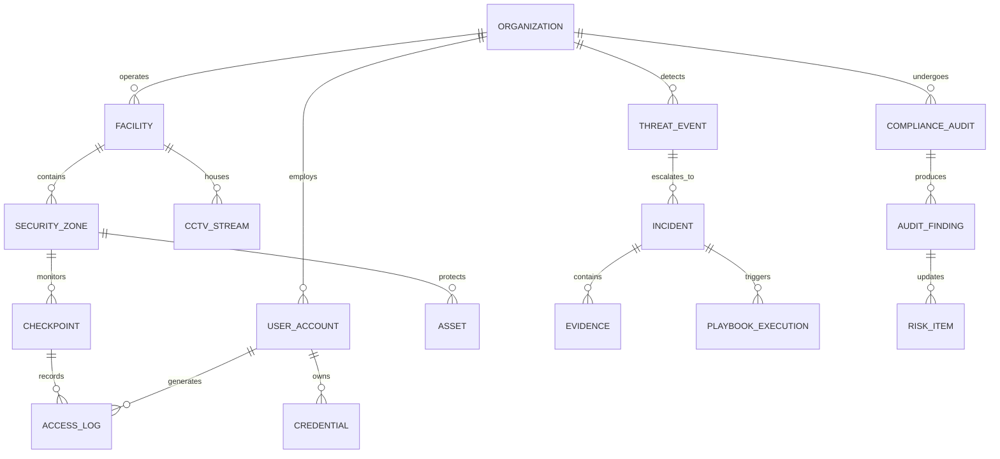

# 🧠 RedFort — Core System Architecture & Platform Brain (`brain.md`)

> **Platform Tagline:** *Fortify Every Asset. Secure Every Operation.*  
> **Classification:** Enterprise Cyber-Physical Security Management & Unified SOC Platform  
> **Design & Product Inspiration:** [Ontic.co](https://ontic.co/) (Corporate Security, Threat Intelligence & GSOC Operations)

---

## 1. Executive Mission & System Overview

**RedFort** is a next-generation unified enterprise security operations platform. Modern enterprises face severe blind spots caused by disconnected security stacks:

```
                  THE ENTERPRISE SECURITY DISCONNECT
                  
    [ CYBERSECURITY (SIEM / EDR) ]          [ PHYSICAL SECURITY (CCTV / PACS) ]
       • Splunk, CrowdStrike, Sentinel          • HID Badges, Milestone CCTV, Lenel
       • IP logs, Endpoint alerts, Auth          • Turnstiles, Door alarms, Sensors
                   │                                         │
                   ▼                                         ▼
            [ SILOED ALERT ]                          [ SILOED ALERT ]
          (No Physical Context)                     (No Cyber Identity Context)
                   └────────────────────┬────────────────────┘
                                        │
                                        ▼
                        [ 💥 CORRELATED THREAT MISSED ]
                  (Impossible Travel / Insider Data Exfiltration)
```

**RedFort solves this by bridging the physical-digital divide**, ingesting real-time cyber telemetry, physical access control systems (PACS), video surveillance (CCTV/VMS), visitor identity logs, and governance/risk registers into a single **Security Operations Center (SOC / GSOC)** command platform.

---

## 2. Core Functional Pillars

```
                              ┌─────────────────────────────────────────────────────────┐
                              │                        REDFORT                          │
                              │        Fortify Every Asset. Secure Every Operation.      │
                              └────────────────────────────┬────────────────────────────┘
         ┌──────────────────┬───────────────┴──────────────┬──────────────────┐
         ▼                  ▼                              ▼                  ▼
┌─────────────────┐┌─────────────────┐           ┌─────────────────┐┌─────────────────┐
│   Cyber & SOC   ││Physical Security│           │Identity & Access││   Incident &    │
│   Operations    ││  & Facilities   │           │   Governance    ││ Compliance GRC  │
├─────────────────┤├─────────────────┤           ├─────────────────┤├─────────────────┤
│• SIEM Ingestion ││• Spatial Map/GIS│           │• Cyber IAM      ││• Incident SOAR  │
│• Threat Correl. ││• CCTV / Alarms  │           │• Physical PACS  ││• Root Cause RCA │
│• Posture Scores ││• Visitor Checkin│           │• Badge & Assets ││• Audits / Regs  │
│• MITRE Mapping  ││• Checkpoints    │           │• Anomaly Auth   ││• Emergency Comms│
└─────────────────┘└─────────────────┘           └─────────────────┘└─────────────────┘
```

### Pillar 1: Spatial Facility & Campus Hierarchy
Organizes enterprise physical assets into an interactive tree:
$$\text{Enterprise Organization} \longrightarrow \text{Campus / Region} \longrightarrow \text{Facility / Building} \longrightarrow \text{Floor / Zone} \longrightarrow \text{Checkpoint / Asset}$$

* **Security Zones**: Categorized by clearance level (Public Reception, General Office, Restricted Labs, Server Datacenter, Executive Suites).
* **Asset Types**: IP Endpoints, Servers, Firewalls, CCTV Cameras, Turnstiles, Mag-locks, Environmental/Motion Sensors.

### Pillar 2: Cross-Domain Threat Correlation Engine (Complex Event Processing - CEP)
RedFort’s core intelligence engine evaluates events against multi-vector heuristic rules:

| Correlation Scenario | Cyber Event | Physical Event | Engine Output & Automated Action |
| :--- | :--- | :--- | :--- |
| **Impossible Travel / Credential Theft** | Privileged SSH / VPN Login from Tokyo IP at 14:02 UTC | Badge swipe at London HQ Turnstile at 14:00 UTC | **Critical Anomaly:** Immediate session termination + SMS alert to user + SecOps triage ticket. |
| **Physical Server Breach** | Network interface unplugged / DB connection drops | Datacenter Server Room door forced open alarm | **P1 Critical Incident:** Lock down adjacent corridor doors + PTZ camera auto-track + Guard dispatch. |
| **Unauthorized After-Hours Tailgating** | Zero cyber auth activity recorded on floor | PIR Motion sensor trigger in Finance dept at 02:30 AM | **High Priority Alarm:** Guard patrol alert with floor snapshot + automated lighting trigger. |
| **Terminated Employee Exfiltration** | HR System status changed to "Terminated" | Badge swipe attempt at Main Gate | **Access Denied:** Card instantly invalidated + Guard console visual alert + Security booth flag. |

### Pillar 3: Centralized SOC / GSOC Command Center
* **Live Incident Feed**: Chronological, auto-refreshing telemetry stream with severity tagging (`P1 CRITICAL`, `P2 HIGH`, `P3 MEDIUM`, `P4 LOW`).
* **Interactive Facility GIS / Floorplan Map**: Interactive SVG/Canvas spatial map rendering real-time device health, alarms, and badge swipe animations.
* **Live Video Matrix**: ONVIF / RTSP camera stream simulator with motion bounding boxes and guard bookmarking.
* **Threat Telemetry Visualizer**: Real-time charts for Attack Vectors (DDoS, Brute Force, Phishing, Perimeter Breach), MTTD/MTTR analytics, and System Health.

### Pillar 4: Unified Identity & Access Control (IAM + PACS)
* **Digital & Physical Identity Convergence**: One profile manages Okta/Azure AD SSO groups, RFID card serial numbers, biometric face templates, and security clearance tier.
* **Visitor Management Lifecycle**:
  1. Host pre-registers visitor $\rightarrow$ 2. QR code sent via email $\rightarrow$ 3. Self-kiosk check-in & NDA signing $\rightarrow$ 4. Host auto-notified via Slack/SMS $\rightarrow$ 5. Time-bounded digital pass issued $\rightarrow$ 6. Exit scan & pass revocation.

### Pillar 5: SOAR Incident Response & Investigation Locker
* **Dynamic Playbook Execution**: Step-by-step automated and guided runbooks (Containment $\rightarrow$ Evidence Preservation $\rightarrow$ Notification $\rightarrow$ RCA).
* **Cryptographic Evidence Locker**: Uploaded CCTV video clips, audit log snapshots, packet captures, and witness notes cryptographically hashed ($SHA-256$) for tamper-proof compliance.
* **Root Cause Analysis (RCA)**: Structured post-incident workflow linking root causes directly to risk register mitigations and policy updates.

### Pillar 6: Governance, Risk Assessment & Compliance (GRC)
* **Real-Time Security Posture Score ($0-100\%$)**: Calculated dynamically:
  $$\text{Posture Score} = 100 - \sum (\text{Active Vulnerabilities} \times w_v + \text{Physical Breaches} \times w_p + \text{Audit Gaps} \times w_a)$$
* **Compliance Framework Mapping**: Built-in checklists and live audit evidence collectors for **ISO 27001**, **SOC 2 Type II**, **NIST CSF**, **PCI-DSS**, and **OSHA Physical Safety**.

### Pillar 7: Emergency Broadcast & Critical Communications
* **Instant Multi-Channel Alerting**: Broadcast emergency notifications across Mobile Push, SMS, Desktop Overlays, Email, and Facility Public Address (PA) systems.
* **Mustering & Roll-Call System**: Real-time evacuation tracking counting accounted vs unaccounted personnel during fire or active threats.

---

## 3. User Persona Matrix & Role-Based Workflows

```
┌───────────────────────────────┬──────────────────────────────────────────────────────────────────┐
│ Persona / Role                │ Primary Views & Responsibilities                                │
├───────────────────────────────┼──────────────────────────────────────────────────────────────────┤
│ 👑 Chief Security Officer (CSO)│ Executive Dashboard, Risk Heatmap, Board Reports, Compliance ROI │
│ 🛡️ SOC Security Analyst        │ Unified Incident Feed, Correlated Alerts, Triage, SOAR Playbooks│
│ 💻 IT Administrator           │ Asset Registry, Syslog/API Connectors, IAM Sync, Sensor Health   │
│ 👮 Security Guard / Field Ops │ Guard Console, Checkpoint QR Scanner, Visitor Badge, Panic Alert │
│ 👤 Enterprise Employee        │ Digital ID Badge, Visitor Invitations, Safety Check-in, Reports  │
│ 📋 Compliance Auditor         │ Immutable Audit Trails, Framework Checklists, Evidence Exports   │
│ ⚙️ System Admin               │ Tenant Setup, Facility Builder, RBAC & Security Policy Config    │
└───────────────────────────────┴──────────────────────────────────────────────────────────────────┘
```

---

## 4. Entity-Relationship & Domain Data Model



---

## 5. MVP Public Web Experience & Showcase Strategy

Modeled after **Ontic.co**, the public web application features:

1. **Global Sticky Header & Announcement Ribbon**:
   * Critical threat webinar/announcement banner.
   * Brand Logo with active radar/shield animation.
   * Multi-column mega-menus (Solutions by Program, Platform Capabilities, Resources).
   * High-contrast CTA buttons: `Book Executive Briefing` & `Client Login`.

2. **Hero Section**:
   * Space-Mono eyebrow badge: `[ NEXT-GEN GSOC & CYBER-PHYSICAL THREAT INTELLIGENCE ]`
   * Headline: *Unified Security Intelligence for the Modern Enterprise.*
   * Subtitle: *Eliminate the blind spot between cybersecurity and physical defense.*
   * Live Interactive SOC Preview Simulator with real-time streaming mock events.

3. **Enterprise Social Proof & Trust Ticker**:
   * Global leaders across Aerospace, Banking, Critical Infrastructure, and Tech.
   * Security certifications: SOC 2 Type II, ISO 27001, FedRAMP In-Process, HIPAA.

4. **Interactive Capabilities Tabs (Ontic "Tabs Stories" style)**:
   * 4 interactive tabs with timer bars and live interactive cards:
     * *01. Unified SOC Command*
     * *02. Physical Access & CCTV*
     * *03. Cyber-Physical Correlation*
     * *04. SOAR & Incident Response*

5. **Solutions by Industry & Executive Persona**:
   * Tailored flows for CSOs, IT Directors, Physical Security Managers, and Compliance Teams.

6. **Interactive Cyber-Physical Threat Simulator Widget**:
   * Allows prospects to test scenarios (e.g. "Simulate Credential Hijacking + Badge Clone") and witness how RedFort correlates and mitigates the threat in sub-seconds.

7. **Interactive Risk Assessment / ROI Calculator**:
   * Dynamic sliders for enterprise size, facilities count, and incident frequency calculating hours saved and risk reduction.

8. **Enterprise Platform Demo & Public Interactive Console**:
   * Seamless transition from marketing landing page into the live working prototype dashboard.

---

## 6. Technical Stack & Architecture

* **Framework:** Next.js 16 (App Router) + React 19 + TypeScript
* **Styling:** Tailwind CSS v4 with custom Ontic-inspired theme tokens
* **Icons:** Lucide React + custom SVG hardware/cyber badges
* **Animation & Interactivity:** Smooth CSS transitions, Canvas/SVG spatial floorplans, live state machines
* **State Management:** React hooks + simulated WebSocket event streams
